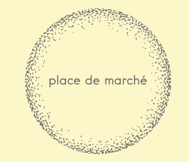
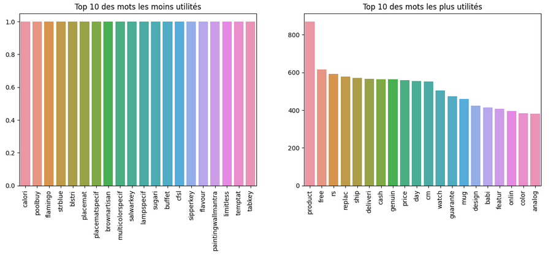
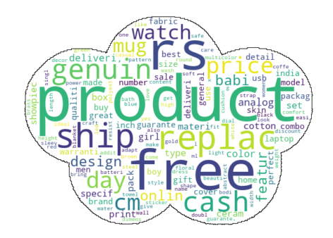
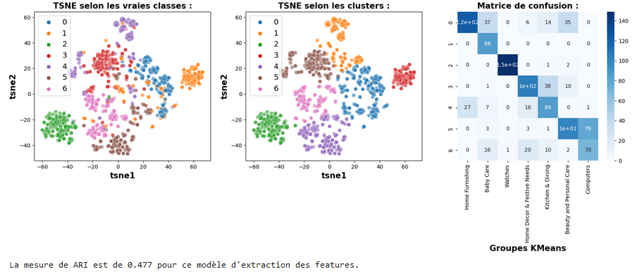
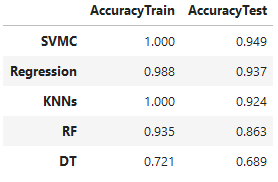
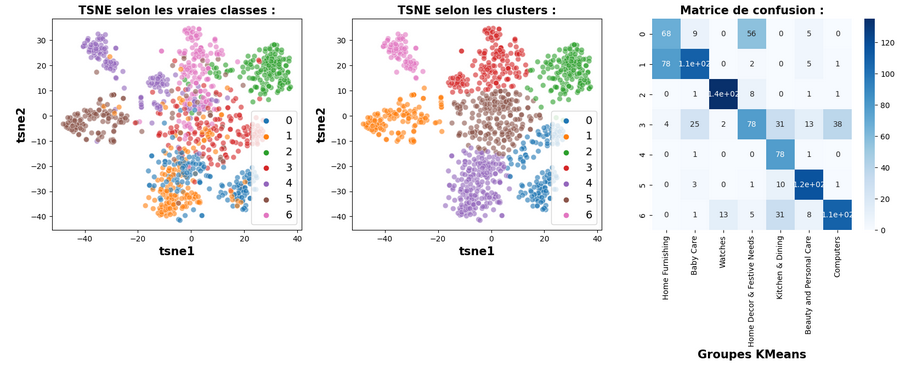

# Projet N°5 : Classifiez automatiquement des biens de consommation

## Mise en situation :
- **Entreprise :** Place de marché
- **Logo :** 
- **Activité :**  marketplace e-commerce
- **But :** Attribuer automatiquement des noms de catégorie aux produits vendus par les clients (grâce aux photos ou aux descriptions)
- **Jeux de données :** [Les Données](https://s3-eu-west-1.amazonaws.com/static.oc-static.com/prod/courses/files/Parcours_data_scientist/Projet+-+Textimage+DAS+V2/Dataset+projet+pre%CC%81traitement+textes+images.zip)
- **Missions :**
    - L'attribution de la catégorie d'un article est effectuée manuellement par les vendeurs, et est donc peu fiable.
    - Nécéssité d'automatiser cette tâche.
    - Etudier la faisabilité d'un moteur de classification des articles en différentes catégories, avec un niveau de précision suffisant.
    - Via les images et la description.
    - Etudier la faisabilité de récupérer les informations de différents produits de consommation via une API.

## Réalisations :
- **Librairies principales :** Wordcloud, PIL, seaborn, différents modèles de ML, requests, json
- **Etapes réalisées :**
    - **Prétraitements :**
        - Ouverture des données et analyse du remplissage de la DataFrame
        - Etude de l'arbre de classification des produits (Les classifications se feront sur le niveau 1)
        - Nettoyage des données (Tokenisation, Suppression des stops words et ponctuations, Stemming/Lemmatizing) textuelles (Titres et descriptions) et visualisation :
            - Etude du nombre de mots dans la totalité de la DataFrame :
         
            
            - Visualisation des mots en fonction de leur fréquence :
         
              
    - **NLP :**
        - **Types d'analyses NLP :** CountVectorizer, Tfidf, Word2Vec, BERT et USE
        - **Pour chaque type d'analyse j'ai réalisé :**
            - Une étude visuelle des groupes réels vs groupes crées en KMeans via TSNE pour avoir que deux variables et une matrice de confusion pour observer la pertinance des prédictions :
         
              
            - Une étude en Machine Learning via différents modèles pour déterminer si une classification des produits est réalisable via NLP :
         
              
         
    - **Images :**
        - **Types d'analyse d'images :** SIFT et CNN transfert learning
        - **Pour chaque type d'analyse j'ai réalisé :**
            - Une étude visuelle des groupes réels vs groupes crées en KMeans via TSNE pour avoir que deux variables et une matrice de confusion pour observer la pertinance des prédictions :
              
              
            - Une étude en Machine Learning via différents modèles pour déterminer si une classification des produits est réalisable via extractions des features depuis des images :
         
              

    - **API Epicerie Fine :**
        - **L'API :** [Lien vers l'API](https://rapidapi.com/edamam/api/edamam-food-and-grocery-database)
        - **Extraction des informations sur le champagne :**
          
